# **keyestudio UNO R3 Breadboard Kit**

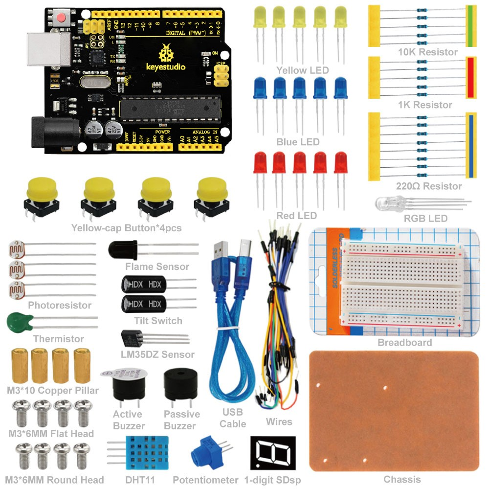

# 1. Introduction

UNO R3 Breadboard Kit is a learning kit based on UNO R3 development board. It's equipped with basic elements for ARDUINO experiments, including breadboard, Dupont wires, LEDs, resistors. With this kit, you can perform simple LED experiments, such as LED blinking, LED chasing effect, etc. It is both affordable and portable for your Arduino learning.

# 2. Kit List

| **No.** | **Name**                     | **QTY** | **Picture**                                                                                                                                                                                  |
|---------|------------------------------|---------|----------------------------------------------------------------------------------------------------------------------------------------------------------------------------------------------|
| 1       | keyestudio UNO R3 Controller | 1       |                                                                                                                                              |
| 2       | Wires                        | 30      | 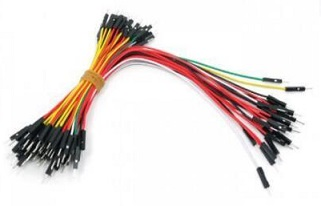                                                                                                                                             |
| 3       | M3\*10 Copper Pillar         | 4       | 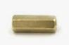                                                                                                                                             |
| 4       | M3\*6MM Flat Head            | 4       |                                                                                                                                              |
| 5       | M3\*6MM Round Head           | 4       |                                                                                                                                              |
| 6       | Yellow Button Cap            | 4       |  |
| 7       | Breadboard                   | 1       |                                                                                                                                              |
| 8       | Chassis                      | 1       |                                                                                                                                              |
| 9       |  1-digit LED Segment Display | 1       |                                                                                                                                              |
| 10      | Active Buzzer                | 1       |                                                                                                                                              |
| 11      | Passive Buzzer               | 1       |                                                                                                                                              |
| 12      | Thermistor                   | 1       |                                                                                                                                              |
| 13      | 10K Resistor                 | 5       |                                                                                                                                              |
| 14      | 1K Resistor                  | 5       |                                                                                                                                              |
| 15      | 220R Resistor                | 8       |                                                                                                                                              |
| 16      | Tilt Switch                  | 2       |                                                                                                                                              |
| 17      | Photoresistor                | 3       |                                                                                                                                              |
| 18      | Flame Sensor                 | 1       |                                                                                                                                              |
| 19      | DHT11 Sensor                 | 1       |                                                                                                                                              |
| 20      | LM35DZ Sensor                | 1       |                                                                                                                                              |
| 21      | Push Button                  | 4       | !
| 22      | RGB LED                      | 1       |                                                                                                                                              |
| 23      | Blue LED                     | 5       | 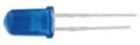                                                                                                                                             |
| 24      | Yellow LED                   | 5       | 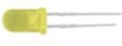                                                                                                                                             |
| 25      | Red LED                      | 5       | 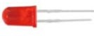                                                                                                                                             |
| 26      | Potentiometer                | 1       |                                                                                                                                              |
| 27      | USB Cable                    | 1       |                                                                                                                                              |

# 3. keyestudio UNO R3

● Microcontroller: ATmega328
● Operating Voltage: 5V
● Input Voltage (recommended) : 7-12V
● Input Voltage (limits): 6-20V
● Digital I/O Pins: 14 (of which 6 provide PWM output)
● Analog Input Pins: 6
● DC Current per I/O Pin: 20 mA
● DC Current for 3.3V Pin: 50 mA
● Flash Memory: 32 KB (ATmega328) of which 0.5 KB used by bootloader
● SRAM: 2 KB (ATmega328)
● EEPROM: 1 KB (ATmega328)
● Clock Speed: 16 MHz
● Length: 8.6 mm
● Width: 53.4 mm
● Weight: 25 g

See http://arduino.cc for detailed specifications, overviews, schematics, etc.
Core functions, code examples, and links to many of the device libraries can be found in the learning section; refer to the manufacturer's site if using other add-on shields or sensors.

The latest Arduino Integrated Development Environment (IDE) necessary for programming your UNO R3 Board can be obtained at
http://arduino.cc/en/Main/Software (the Download menu choice on Arduino.cc)

Examples for many basic components can be found under the Examples menu. As you install libraries for additional shields, new examples may be available.

Follow the getting started guide found on the arduino.cc web site. Click learning, and select Getting started. Click on the link for Windows, Mac OS X, or Linux for more specific directions.

# 4. Getting Started

1\. Download the Arduino Environment (IDE) and install or unzip/extract the application directory.

2\. Connect the UNO board to one of your computer's USB port.

3\. Install the drivers (If the computer does not automatically download and install the necessary USB drivers, point the hardware setup to the "drivers" directory of the Arduino IDE application.)

4\. Launch the Arduino IDE application

5\. Open a sketch example such as "Blink"

6\. Select your Board from the Tools menu.

7\. Select the Serial Port used by the board

8\. Upload the sketch to the board

# 5. Project Details

## Project 1: Hello World

**Introduction**

As for starters, we will begin with something simple. In this project, you only need an Arduino and a USB cable to start the "Hello World!" experiment. This is a communication test of your Arduino and PC, also a primer project for you to have your first try of the Arduino world!

**Hardware Required**

1.UNO R3 Board \*1

2.USB Cable \*1

**Sample Program**

After installing driver for Arduino, let's open Arduino software and compile code that enables Arduino to print "Hello World!" under your instruction. Of course, you can compile code for Arduino to continuously echo "Hello World!" without instruction. A simple If () statement will do the instruction trick. With the onboard LED connected to pin 13, we can instruct the LED to blink first when Arduino gets an instruction and then print "Hello World!”.
   
<iframe src=https://create.arduino.cc/editor/keyestudio/0b418251-1092-401e-becc-ec9455c8925e/preview?embed style="height:510px;width:100%;margin:10px 0" frameborder=0></iframe>
   

**Result**

Click serial port monitor,Input R,LED 13 will blink once,PC will receive information from Arduino: Hello World

After you choosing the right port，the experiment should be easy for you!

## Project 2：LED blinking

**Introduction**

Blinking LED experiment is quite simple. In the "Hello World!" program, we have come across LED. This time, we are going to connect an LED to one of the digital pins rather than using LED13, which is soldered to the board. Except an Arduino and an USB cable, we will need extra parts as below.

**Hardware Required**

1.UNO R3 Board \*1

2.USB Cable \*1

3\. Red M5 LED\*1

4\. 220Ω Resistor\*1

5 Breadboard\*1

6\. Breadboard Jumper Wires\* Several

We follow below diagram from the experimental schematic link. Here we use digital pin 10. We connect LED to a 220 ohm resistor to avoid high current damaging the LED.

**Circuit Connection**

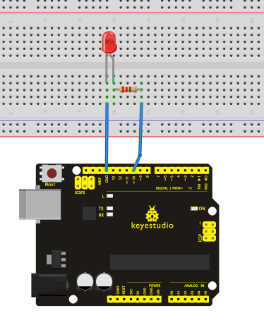

**Sample Program**

According to the above circuit, you can start compiling the program, turning the LED 1 second on and 1 second off. This program is simple and similar to one that comes with Arduino except it’s connected to digital pin 10.

<iframe src=https://create.arduino.cc/editor/keyestudio/72a9056d-d048-4c50-bcfe-9c7220992dd6/preview?embed style="height:510px;width:100%;margin:10px 0" frameborder=0></iframe>

**Result**

After downloading this program, in the experiment, you will see the LED connected to pin 10 turning on and off, with an interval approximately one second.

The blinking LED experiment is now completed.

## Project 3: Traffic Light

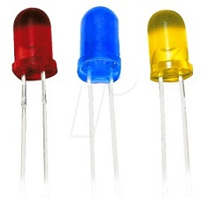

**Introduction**

In the previous program, we have done the LED blinking experiment with one LED.
Now, it’s time to up the stakes and do a bit more complicated experiment-traffic lights. Actually, these two experiments are similar. While in this traffic lights experiment, we use 3 LEDs with different color other than 1 LED.

**Hardware Required**

1\. UNO R3 Board \*1

2.USB Cable \*1

3.Red M5 LED\*1

4.Yellow M5 LED\*1

5.Blue M5 LED\*1

6.220Ω Resistor \*3

7.Breadboard\*1

8\. Breadboard Jumper Wires\* Several

**Circuit Connection**

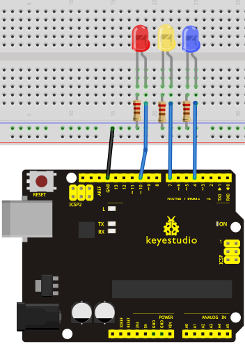

**Sample Program**

Since it is a simulation of traffic lights, the blinking time of each LED should be the same with those in traffic lights system. In this program, we use Arduino delay () function to control delay time, which is much simpler than C language.

<iframe src=https://create.arduino.cc/editor/keyestudio/e592a96b-2c5b-48f5-9fcd-ec86ffcb7b19/preview?embed style="height:510px;width:100%;margin:10px 0" frameborder=0></iframe>

**Result**

When the uploading process is completed, we can see traffic lights of our own design.

Note: this circuit design is very similar with the one in LED chase effect.

The blue light will be on for 5 seconds, and then off., followed by the yellow light blinking for 3 times, and then the red light on for 5 seconds, forming a cycle. Cycle then repeats.

Experiment is now completed, thank you.

## Project 4: LED Chasing Effect

**Introduction**

We often see billboards composed of colorful LEDs. They are constantly changing to form various effects. In this experiment, we compile a program to simulate chase effect.

**Hardware Required**

1\. UNO R3 Board \*1

2\. USB Cable \*1

3\. Red M5 LED\*2

4\. Yellow M5 LED\*2

5\. Blue M5 LED\*2

6\. 220Ω Resistor \*6

7\. Breadboard\*1

8\. Breadboard Jumper Wires\* Several

**Circuit Connection**

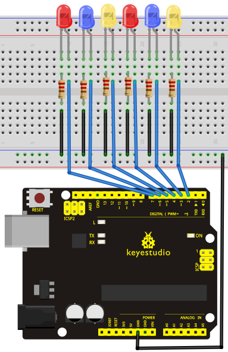

**Sample Program**

<iframe src=https://create.arduino.cc/editor/keyestudio/82f5e712-141c-49cc-8ae6-e35606b19731/preview?embed style="height:510px;width:100%;margin:10px 0" frameborder=0></iframe>

**Result**

You can see the LEDs blink by sequence.

## Project 5: Button-controlled LED

**Introduction**

I/O port means interface for INPUT and OUTPUT. Up until now, we have only used its OUTPUT function. In this experiment, we will try to use the input function, which is to read the output value of device connecting to it. We use 1 button and 1 LED using both input and output to give you a better understanding of the I/O function. Push Buttones, familiar to most of us, are a switch value (digital value) component. When it's pressed, the circuit is in closed (conducting) state.

**Hardware Required**

1\. UNO R3 Board \*1

2\. USB Cable \*1

3\. Push Button\*1

4\. Red M5 LED\*1

5\. 220Ω Resistor\*1

6\. 10KΩ Resistor\*1

7\. Breadboard\*1

8\. Breadboard Jumper Wires\* Several

**Circuit Connection**

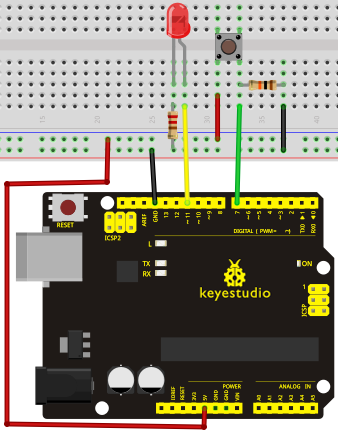

**Sample Program**

Now, let's begin the compiling. When the button is pressed, the LED will be on.
After the previous study, the coding should be easy for you. In this program, we add a statement of judgment. Here, we use an if () statement.

Arduino IDE is based on C language, so statements of C language such as while, switch etc. can certainly be used for Arduino program.

When we press the button, pin 5 will output high level. We can program pin 10 to output high level and turn on the LED. When pin 5 outputs low level, pin 10 also outputs low level and the LED remains off.

<iframe src=https://create.arduino.cc/editor/keyestudio/9aaee9ef-a9f6-46b1-a132-1ab5840659dd/preview?embed style="height:510px;width:100%;margin:10px 0" frameborder=0></iframe>

**Result**

When the button is pressed, LED is on, otherwise, LED remains off. After the above process, the button controlled LED experiment is completed. The simple principle of this experiment is widely used in a variety of circuit and electric appliances. You can easily come across it in your every day life. One typical example is when you press a certain key of your phone, the backlight will be on.

## Project 6: Responder experiment

**Introduction**

After completing all the previous experiments, we believe you will find this one easy. In this program, we have 3 buttons and a reset button controlling the corresponding 3 LEDs, using 7 digital I/O pins.

**Hardware Required**

1\. UNO R3 Board \*1

2.USB Cable \*1

3.Push Button\*4

4.Red M5 LED\*1

5.Yellow M5 LED\*1

6.Blue M5 LED\*1

7.220Ω Resistor\*3

8.10KΩ Resistor\*4

9.Breadboard\*1

10.Breadboard Jumper Wires\* Several

**Circuit Connection**

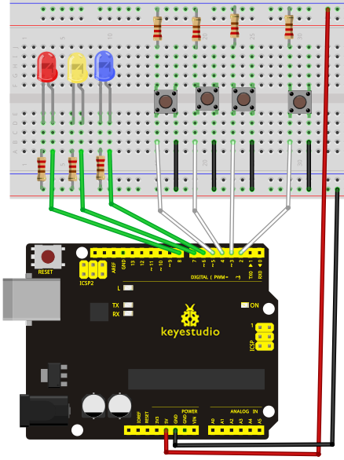

**Sample Program**

<iframe src=https://create.arduino.cc/editor/keyestudio/45269c98-d2cf-4318-b59c-dcc83b858f7f/preview?embed style="height:510px;width:100%;margin:10px 0" frameborder=0></iframe>

**Result**

Whichever button is pressed first, the corresponding LED will be on!

Then press the REST button to reset.

After the above process, we have built our own simple responder.

## Project 7: Active Buzzer

**Introduction**

Active buzzer is widely used on computer, printer, alarm, electronic toy, telephone, timer etc as a sound making element. It has an inner vibration source. Simply connect it with 5V power supply, it can buzz continuously.

**Hardware Required**

1.UNO R3 Board \*1

2.USB Cable \*1

3.Active Buzzer\*1

4.Breadboard\*1

5.Breadboard Jumper Wires\* Several

**Circuit Connection**

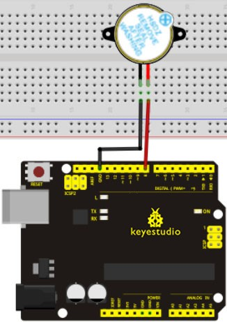

When connecting the circuit, pay attention to the positive & the negative poles of the buzzer. In the photo, you can see there are red and black lines. When the circuit is finished, you can begin programming.

**Sample Program**

Program is simple. You control the buzzer by outputting high/low level.

<iframe src=https://create.arduino.cc/editor/keyestudio/0f14b0b4-b323-4654-b7fb-51d8d1fc5587/preview?embed style="height:510px;width:100%;margin:10px 0" frameborder=0></iframe>

**Result**

After downloading the program, the buzzer experiment is completed. You can see the buzzer is ringing.

## Project 8: Passive Buzzer

**Introduction**

We can use Arduino to make many interactive works of which the most commonly used is acoustic-optic display. All the previous experiment has something to do with LED. However, the circuit in this experiment can produce sound. Normally, the experiment is done with a buzzer or a speaker while buzzer is simpler and easier to use. The buzzer we introduced here is a passive buzzer. It cannot be actuated by itself, but by external pulse frequencies. Different frequencies produce different sounds. We can use Arduino to code the melody of a song, which is actually quite fun and simple.

**Hardware Required**

1\. UNO R3 Board \*1

2\. USB Cable \*1

3\. Passive Buzzer\*1

4\. Breadboard\*1

5\. Breadboard Jumper Wires\* Several

**Circuit Connection**

**Sample Program**

<iframe src=https://create.arduino.cc/editor/keyestudio/f1aadc39-7e14-4956-b88e-67fe6f1fe4c6/preview?embed style="height:510px;width:100%;margin:10px 0" frameborder=0></iframe>

After downloading the program, buzzer experiment is finished.

## Project 9: RGB LED

**Introduction**

Tricolor principle to display various colors.

PWM controlling ports to display full color.

Can be driven directly by Arduino PWM interfaces.

**Hardware Required**

1\. UNO R3 Board \*1

2\. USB Cable \*1

3\. RGB LED \*1

4\. 220Ω Resistor\*3

5\. Breadboard\*1

6\. Breadboard Jumper Wires\* Several

**Circuit Connection**

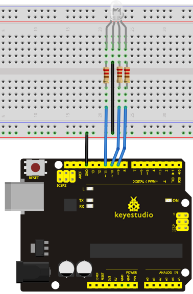

**Sample Program**

<iframe src=https://create.arduino.cc/editor/keyestudio/bafb360f-29cc-428c-870d-12c62759a9d4/preview?embed style="height:640px;width:100%;margin:10px 0" frameborder=0></iframe>

**Result**

Directly copy the above code into arduino IDE, and click upload, wait a few seconds, you can see a full-color LED

## Project 10: Analog Value Reading

**Introduction**

In this experiment, we will begin the learning of analog I/O interfaces. On an Arduino, there are 6 analog interfaces numbered from 0 to 5. These 6 interfaces can also be used as digital ones numbered as 14-19. After a brief introduction, let's begin our project. Potentiometer used here is a typical output component of analog value that is familiar to us.

**Hardware Required**

1\. UNO R3 Board \*1

2\. USB Cable \*1

3\. Potentiometer \*1

4\. Breadboard\*1

5\. Breadboard Jumper Wires\* Several

**Circuit Connection**

In this experiment, we will convert the resistance value of the potentiometer to analog ones and display it on the screen. This is an application we need to master well for our future experiments.

Connection circuit as below:

We use the analog interface 0.

The analog interface we use here is interface 0.

**Sample Program**

The program compiling is simple. An analogRead () Statement can read the value of the interface. The A/D acquisition of Arduino 328 is in 10 bits, so the value it reads is among 0 to 1023. One difficulty in this project is to display the value on the screen, which is actually easy to learn. First, we need to set the baud rate in voidsetup (). Displaying the value is a communication between Arduino and PC, so the baud rate of the Arduino should match the the one in the PC's software set up. Otherwise, the display will be messy codes or no display at all. In the lower right corner of the Arduino software monitor window, there is a button for baud rate set up. The set up here needs to match the one in the program. The statement in the program is Serial.begin(); enclosed is the baud rate value, followed by statement for displaying. You can either use Serial.print() or Serial.println() statement.

<iframe src=https://create.arduino.cc/editor/keyestudio/b457e219-d29b-4199-8067-20c59ab81b12/preview?embed style="height:510px;width:100%;margin:10px 0" frameborder=0></iframe>

**Result**

The Sample Program uses the built-in LED connected to pin 13. Each time the device reads a value, the LED blinks.

Below is the analog value it reads.

When you rotate the potentiometer knob, you can see the displayed value changes.
The reading of analog value is a very common function since most sensors output analog value. After calculation, we can have the corresponding value we need.

The experiment is now completed, thank you.

## Project 11: Photo Resistor

**Introduction**

After completing all the previous experiments, we acquired some basic understanding and knowledge about Arduino application. We have learned digital input and output, analog input and PWM. Now, we can begin the learning of sensors applications.

Photo resistor (Photovaristor) is a resistor whose resistance varies according to different incident light strength. It's made based on the photoelectric effect of semiconductor. If the incident light is intense, its resistance reduces; if the incident light is weak, the resistance increases. Photovaristor is commonly applied in the measurement of light, light control and photovoltaic conversion (convert the change of light into the change of electricity).

Photo resistor is also being widely applied to various light control circuit, such as light control and adjustment, optical switches etc.

We will start with a relatively simple experiment regarding photovaristor application. Photovaristor is an element that changes its resistance as light strenth changes. So we will need to read the analog values. We can refer to the PWM experiment, replacing the potentiometer with photovaristor. When there is change in light strength, there will be corresponding change on the LED.

**Hardware Required**

1\. UNO R3 Board \*1

2\. USB Cable \*1

3\. Photo Resistor\*1

4\. Red M5 LED\*1

5\. 10KΩ Resistor\*1

6\. 220Ω Resistor\*1

7\. Breadboard\*1

8\. Breadboard Jumper Wires\* Several

**Circuit Connection**

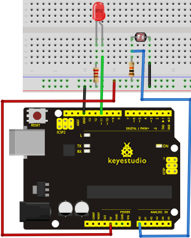

**Sample Program**

After the connection, let's begin the program compiling. The program is similar
to the one of PWM. For change detail, please refer to the Sample Program below.

<iframe src=https://create.arduino.cc/editor/keyestudio/038bef70-f67f-413a-8b57-dc35fa8ce4d4/preview?embed style="height:510px;width:100%;margin:10px 0" frameborder=0></iframe>

**Result**

After downloading the program, you can change the light strength around the photovaristor and see corresponding brightness change of the LED. Photovaristors has various applications in our everyday life. You can make other interesting interactive projects base on this one.

## Project 12: Flame Sensor

**Introduction**

Flame sensor (Infrared receiving triode) is specially used on robots to find the fire source. This sensor is of high sensitivity to flame. Below is a photo of it.

**Working Principle**

Flame sensor is made based on the principle that infrared ray is highly sensitive to flame. It has a specially designed infrared receiving tube to detect fire, and then convert the flame brightness to fluctuating level signal.
The signals are then input into the central processor and be dealt with accordingly.

**Sensor Connection**

The shorter lead of the receiving triode is for negative, the other one for positive. Connect negative to 5V pin, positive to resistor; connect the other end of the resistor to GND, connect one end of a jumper wire to a clip which is electrically connected to sensor positive, the other end to analog pin. As shown below:

**Hardware Required**

1\. UNO R3 Board \*1

2\. USB Cable \*1

3\. Flame Sensor \*1

4\. Buzzer \*1

5\. 10K Resistor \*1

6\. Breadboard\*1

7\. Breadboard Jumper Wires\* Several

**Circuit Connection**

1.  Connecting buzzer:

Connect the controller board, prototype board, breadboard and USB cable according to the Arduino tutorial. Connect the buzzer to digital pin 8.

2）Connecting flame sensor:

Connect the sensor to analog pin 0.

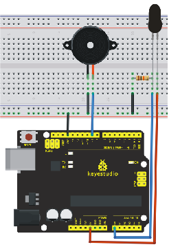

**Experiment Principle**

When it's approaching a fire, the voltage value the analog port reads differs. If you use a multimeter, you can know when there is no fire approaching, the voltage it reads is around 0.3V; when there is fire approaching, the voltage it reads is around 1.0V, tthe nearer the fire, the higher the voltage. So in the beginning of the program, you can initialize voltage value i (no fire value); Then, continuously read the analog voltage value j and obtain difference value k=j-i; compare k with 0.6V (123 in binary) to determine whether or not there is a fire approaching; if yes, the buzzer will buzz.

**Sample Program**

<iframe src=https://create.arduino.cc/editor/keyestudio/a5bff6b3-085b-4852-9011-600be964f049/preview?embed style="height:510px;width:100%;margin:10px 0" frameborder=0></iframe>

**Result**

This program can simulate an alarm when there is a fire. Everything is normal
when there is no fire; when there is, the alarm will be set off immediately.

## Project 13: Analog Temperature (Thermistor)

**Introduction**

Thermistor is a temperature measuring component base on the principle that a conductor changes in resistance with a change in its body temperature. As a result, it requires the temperature coefficient and the resistivity of the conductor to be as large and stable as possible. It is best that the resistance is in linear relationship with temperature. And it should also have stable physical and chemical properties in a wide range. Currently, the most used thermal resistance materials are platinum, nickel and copper.

**Hardware Required**

1\. UNO R3 Board \*1

2\. USB Cable \*1

3\. Thermistor \*1

7\. 10KΩ Resistor \*1

5\. Breadboard\*1

6\. Breadboard Jumper Wires\* Several

**Circuit Connection**

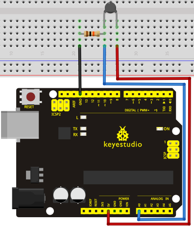

**Sample Program**

<iframe src=https://create.arduino.cc/editor/keyestudio/6039c3f2-e8b0-4be2-97a0-4f473e9f760a/preview?embed style="height:510px;width:100%;margin:10px 0" frameborder=0></iframe>
**Result**

Shown in pic 1 is data displayed by serial port monitor in room temperature.
After the temperature is changed (thermistor wrapped and put into hot water),the data changes as shown in pic 2.

Pic 1

Pic 2

## Project 14: LM35 Temperature Sensor

**Introduction**

LM35 is a common and easy-to-use temperature sensor. It does not require other hardware. You just need an analog port to make it work. The difficulty lies in compiling the code to convert the analog value it reads to celsius temperature.

**Hardware Required**

1\. UNO R3 Board \*1

2\. USB Cable \*1

3\. LM35\*1

4\. Breadboard\*1

5\. Breadboard Jumper Wires\* Several

**Circuit Connection**

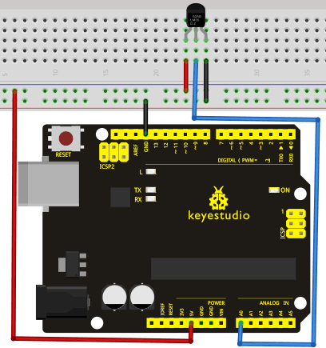

**Sample Program**

<iframe src=https://create.arduino.cc/editor/keyestudio/9631a09a-22cd-4ee6-a94f-9b46055a1cb4/preview?embed style="height:510px;width:100%;margin:10px 0" frameborder=0></iframe>
**Result**

After downloading the program, you can open the monitoring window to see current temperature.

## Project 15: A Cup with Temperature Indicator

**Introduction**

Today, we will use Arduino to make a temperature-indicated cup. First, let’s design the circuit. When the LM35 temperature sensor senses different temperature, different LED will be turned on representing the temperature.

**Hardware Required**

1\. UNO R3 Board \*1

2\. USB Cable \*1

3\. Red M5 LED\*1

4\. Yellow M5 LED\*1

5\. Blue M5 LED\*1

6\. 220Ω Resistor \*3

7\. LM35 Temperature Sensor \*1

8\. Breadboard\*1

9\. Breadboard Jumper Wires\* Several

**Circuit Connection**

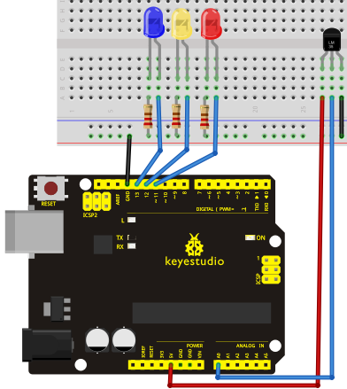

**Sample Program**

 <iframe src=https://create.arduino.cc/editor/keyestudio/c13acdd7-76bb-44d7-8810-f77655db4e04/preview?embed style="height:510px;width:100%;margin:10px 0" frameborder=0></iframe>
**Result**

Corresponding LED will be turned on in accordance with corresponding temperature range.

## Project 16: DHT11 Temperature and Humidity Sensor

**Introduction**

This DHT11 Temperature and Humidity Sensor features calibrated digital signal output with the temperature and humidity sensor complex. Its technology ensures high reliability and excellent long-term stability. A high-performance 8-bit microcontroller is connected. This sensor includes a resistive element and a sense of wet NTC temperature measuring devices. It has excellent quality, fast response, anti-interference ability and high cost performance advantages.

Each DHT11 sensor features extremely accurate calibration data of humidity calibration chamber. The calibration coefficients stored in the OTP program memory, internal sensors detect signals in the process, and we should call these calibration coefficients. The single-wire serial interface system is integrated to make it quick and easy. Qualities of small size, low power, and 20-meter signal transmission distance make it a wide applied application and even the most demanding one. Convenient connection, special packages can be provided according to users need.

**Hardware Required**

1\. UNO R3 Board \*1

2\. USB Cable \*1

3\. Temperature and Humidity Unit \*1

4\. 10K Resistor \*1

5\. Breadboard\*1

6\. Breadboard Jumper Wires\* Several

**Circuit Connection**

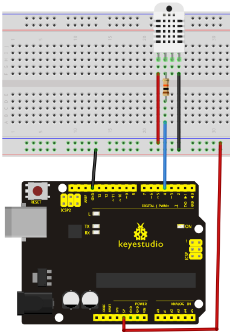

**Sample Program**

Please download the
[DHT11Lib](https://github.com/RobTillaart/Arduino/tree/master/libraries/DHTlib)
firstly. Or [see the website](http://playground.arduino.cc/Main/DHTLib)

 <iframe src=https://create.arduino.cc/editor/keyestudio/7675b340-9634-4ed2-a945-7c45dd219969/preview?embed style="height:510px;width:100%;margin:10px 0" frameborder=0></iframe>
**Result**

## Project 17: Tilt Switch

**Introduction**

Tilt switch controls the ON and OFF of an LED.

**Hardware Required**

1\. UNO R3 Board \*1

2\. USB Cable \*1

3\. Red M5 LED\*1

4\. Ball Switch\*1

5\. 220Ω Resistor \*1

6\. 10kΩ Resistor\*1

7\. Breadboard\*1

8\. Breadboard Jumper Wires\* Several

**Circuit Connection**

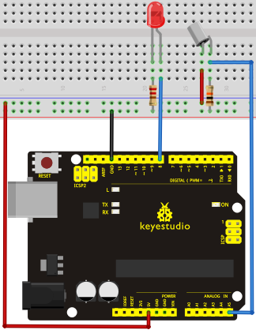

Connect the controller board, shield, breadboard and USB cable according to Arduino tutorial. Connect the LED to digital pin 8, ball switch to analog pin 5.

**Experiment Principle**

When one end of the switch is below horizontal position, the switch is on. The voltage of the analog port is about 5V (1023 in binary). The LED will be on.
When the other end of the switch is below horizontal position, the switch is off. The voltage of the analog port is about 0V (0 in binary). The LED will be off. In the program, we determine whether the switch is on or off according to the voltage value of the analog port, whether it's above 2.5V (512 in binary) or not.

**Sample Program**

 <iframe src=https://create.arduino.cc/editor/keyestudio/173c75ec-b251-4324-b72e-9808a01a9610/preview?embed style="height:510px;width:100%;margin:10px 0" frameborder=0></iframe>

**Result**

Hold the breadboard with your hand. Tilt it to a certain extent, the LED will be on.

If there is no tilt, the LED will be off.

The principle of this experiment can be applied to relay control.

Experiment completed.

Thank you!

## Project 18: Magical Light Cups

**Introduction**

Magical light cup is a product developed by KEYES that can interact with ARDUINO.

The principle is to use PWM to regulate light brightness of the two components.

Mercury switch provides digital signal, triggering PWM to regulate light brightness. Through the designed program,

We can see effect like two cups pouring light to each other.

**Hardware Required**

1\. UNO R3 Board \*1

2\. USB Cable \*1

3\. Red M5 LED\*2

4\. Ball Switch\*2

5\. 220Ω Resistor \*2

6\. 10kΩ Resistor\*2

7\. Breadboard\*1

8\. Breadboard Jumper Wires\* Several

**Circuit Connection**

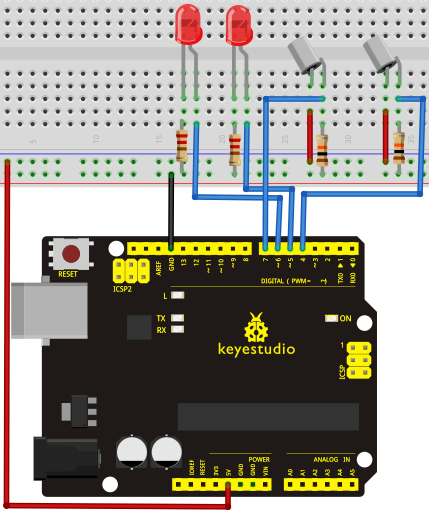

**Sample Program**

 <iframe src=https://create.arduino.cc/editor/keyestudio/9160fc48-f382-409e-a389-3425568272d2/preview?embed style="height:510px;width:100%;margin:10px 0" frameborder=0></iframe>

**Result**

Tilt the circuit to one side, A light on, B light out; tilt to the other side, A light out, B light on.

## Project 19: 1-digit LED Segment Display

**Introduction**

LED segment displays are common for displaying numerical information. It's widely applied on displays of electromagnetic oven, full automatic washing machine, water temperature display, electronic clock etc. It is necessary that we learn how it works.

LED segment display is a semiconductor light-emitting device. Its basic unit is a light-emitting diode (LED). LED segment display can be divided into 7-segment display and 8-segment display according to the number of segments. 8-segment display has one more LED unit ( for decimal point display) than 7-segment one. In this experiment, we use a 8-segment display. According to the wiring method of LED units, LED segment displays can be divided into display with common anode and display with common cathode. Common anode display refers to the one that combine all the anodes of LED units into one common anode (COM).

For the common anode display, connect the common anode (COM) to +5V. When the cathode level of a certain segment is low, the segment is on; when the cathode level of a certain segment is high, the segment is off. For the common cathode display, connect the common cathode (COM) to GND. When the anode level of a certain segment is high, the segment is on; when the anode level of a certain segment is low, the segment is off.

Common cathode 7-segment display

Common anode 7-segment display

Each segment of the display consists of an LED. So when you use it, you also need use a current-limiting resistor. Otherwise, LED will be burnt out. In this experiment, we use a common cathode display. As we mentioned above, for common cathode display, connect the common cathode (COM) to GND. When the anode level of a certain segment is high, the segment is on; when the anode level of a certain segment is low, the segment is off.

**Hardware Required**

1\. UNO R3 Board \*1

2\. USB Cable \*1

3\. 1-digit Segment Display\*1

4\. 220Ω Resistor \*8

5\. Breadboard\*1

6\. Breadboard Jumper Wires\* Several

**Circuit Connection**

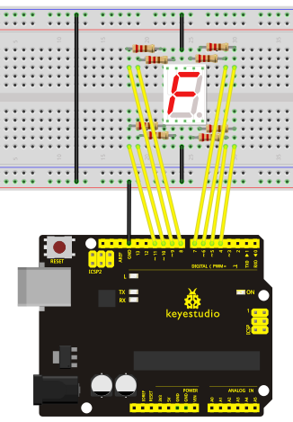

**Sample Program**

There are seven segments for numerical display, one for decimal point display. Corresponding segments will be turned on when displaying certain numbers. For example, when displaying number 1, b and c segments will be turned on. We compile a subprogram for each number, and compile the main program to display one number every 2 seconds, cycling display number 0 \~ 9. The displaying time for each number is subject to the delay time, the longer the delay time, the longer the displaying time.

 <iframe src=https://create.arduino.cc/editor/keyestudio/976759dc-01dd-4e26-a44b-ebc166de094e/preview?embed style="height:510px;width:100%;margin:10px 0" frameborder=0></iframe>

**Result**

LED segment display displays number 0 to 9.

